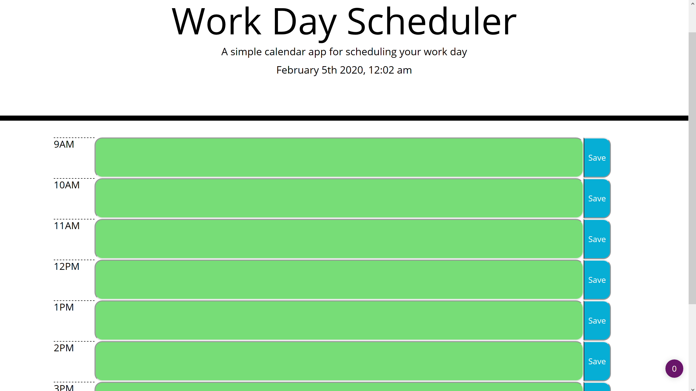

# Work Day Planner 🏢📆

>A simple planner to organize my work day and make myself more productive. 

## 💻What I used💽
HTML5, CSS, JavaScript

## Update Note (Jan 29, 2020)
- Added Skeleton HTML, CSS, and JS

## Update Note (Jan 31, 2020)
- Added time keeping functionality

## I love getting feedback and support! 🎆🎇🎈

## 🧮🗓📱🤙 Preview

##Author

**🏍Dru Sanchez🏍**
*Twitter: [ImNotDrumatic](https://twitter.com/ImNotDrumatic)
*Github:  [DruSanchez](https://github.com/Drubaloo)
